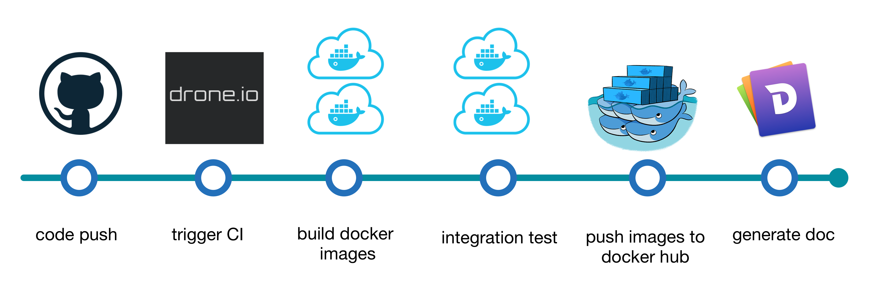

# modbusd

[](https://hub.docker.com/r/edgepro/modbusd)
[](http://taka-wang.github.io/modbusd/api)

Modbus master daemon

- Support doxygen style comments.
- ZeroMQ is a high-level message library, you can replace it with your own data bus implementations without losing the core functionalities.

## Table of content

- [Continuous Integration](#ci)
- [Design](#design)
- [Setup](#setup)
- [Documentation](#doc)

---

<a name="ci"></a>

## Continuous Integration

I do continuous integration and build docker images after git push by self-hosted [drone.io](http://armdrone.cmwang.net) server for armhf platform , [circleci](http://circleci.com) server for x86 platform and [dockerhub](https://hub.docker.com/r/edgepro/modbusd) service.

| CI Server| Target    | Status                                                                                                                                                                     |
|----------|-----------|----------------------------------------------------------------------------------------------------------------------------------------------------------------------------|
| Travis   | API       | [](https://travis-ci.org/taka-wang/modbusd)                                                         |
| CircleCI | x86       | [](https://circleci.com/gh/taka-wang/modbusd) |
| Drone    | armhf     | [](http://armdrone.cmwang.net/taka-wang/modbusd)                                                  |


<a name="design"></a>


## Design

### Implemented libmodbus function codes

>| FC    | Description            | #Len    | API                                                                                                                                                 |
>|:-----:|------------------------|---------|-----------------------------------------------------------------------------------------------------------------------------------------------------|
>| 0x01  | read coils             |  2000   |[int modbus_read_bits(modbus_t *ctx, int addr, int nb, uint8_t *dest)](http://libmodbus.org/docs/v3.1.4/modbus_read_bits.html)                       |
>| 0x02  | read discrete inputs   |  2000   |[int modbus_read_input_bits(modbus_t *ctx, int addr, int nb, uint8_t *dest)](http://libmodbus.org/docs/v3.1.4/modbus_read_input_bits.html)           |
>| 0x03  | read holding registers |  125    |[int modbus_read_registers(modbus_t *ctx, int addr, int nb, uint16_t *dest)](http://libmodbus.org/docs/v3.1.4/modbus_read_registers.html)            |
>| 0x04  | read input registers   |  125    |[int modbus_read_input_registers(modbus_t *ctx, int addr, int nb, uint16_t *dest)](http://libmodbus.org/docs/v3.1.4/modbus_read_input_registers.html)|
>| 0x05  | write single coil      |   -     |[int modbus_write_bit(modbus_t *ctx, int addr, int status)](http://libmodbus.org/docs/v3.1.4/modbus_write_bit.html)                                  |
>| 0x06  | write single register  |   -     |[int modbus_write_register(modbus_t *ctx, int addr, int value)](http://libmodbus.org/docs/v3.1.4/modbus_write_register.html)                         |
>| 0x0F  | write multi coils      |  1968   |[int modbus_write_bits(modbus_t *ctx, int addr, int nb, const uint8_t *src)](http://libmodbus.org/docs/v3.1.4/modbus_write_bits.html)                |
>| 0x10  | write multi registers  |  125    |[int modbus_write_registers(modbus_t *ctx, int addr, int nb, const uint16_t *src)](http://libmodbus.org/docs/v3.1.4/modbus_write_registers.html)     |

### Coil/register number and address table

>|Coil/Register numbers|data address       |type          |table name                     |offset| function code|
>|:--------------------|:------------------|:-------------|:------------------------------|:-----|:-------------|
>|1-9999               |0000 to 270E (9998)|Read-Write    |Discrete Output Coils          |1     | 1, 5, 15     |
>|10001-19999          |0000 to 270E (9998)|Read-Only     |Discrete Input Contacts        |10001 | 2            |
>|30001-39999          |0000 to 270E (9998)|Read-Only     |Analog Input Registers         |30001 | 4            |
>|40001-49999          |0000 to 270E (9998)|Read-Write    |Analog Output Holding Registers|40001 | 3, 6, 16     |

### Command mapping table

>| Command         | Number | Description      |
>|:---------------:|-------:|:-----------------|
>| fc1             |   1    | modbus fc 1      |
>| fc2             |   2    | modbus fc 2      |
>| fc3             |   3    | modbus fc 3      |
>| fc4             |   4    | modbus fc 4      |
>| fc5             |   5    | modbus fc 5      |
>| fc6             |   6    | modbus fc 6      |
>| fc15            |  15    | modbus fc 15     |
>| fc16            |  16    | modbus fc 16     |
>| set_tcp_timeout |  50    | set tcp timeout  |
>| get_tcp_timeout |  51    | get tcp timeout  |


---

### Configuration File

```javascript
{
    "syslog": 1,
    "zmq":
    {
        "sub": "ipc:///tmp/to.modbus",
        "pub": "ipc:///tmp/from.modbus"
    },
    "mbtcp":
    {
        "connect_timeout": 200000
    }
}
```

### Modbus TCP command format

Please refer to [command definition](docs/command.md).

### External libraries

- [libmodbus](http://libmodbus.org)
- [libzmq](https://github.com/zeromq/libzmq)
- [czmq](https://github.com/zeromq/czmq)
- [uthash](https://troydhanson.github.io/uthash)
- [cJSON](https://github.com/DaveGamble/cJSON)

---

### Library documentations

- [uthash user guide](http://troydhanson.github.io/uthash/userguide.html)
- [libmodbus api document](http://libmodbus.org/docs/v3.1.4/)
- [libmodbus header](https://github.com/stephane/libmodbus/blob/master/src/modbus.h)
- [cJSON examples](https://github.com/DaveGamble/cJSON)


### Flow Chart


---

<a name="setup"></a>

## Setup

### Setup development dependencies

```bash
sudo apt-get update
sudo apt-get install -y git build-essential autoconf libtool pkg-config cmake
```

---

### Setup OSS libs dependencies

#### Install libmodbus library (3.1.4)

```bash
git clone https://github.com/stephane/libmodbus/
cd libmodbus
./autogen.sh
./configure
make
sudo make install
sudo ldconfig
```

#### Install libzmq (3.2.5)

```bash
wget https://github.com/zeromq/zeromq3-x/releases/download/v3.2.5/zeromq-3.2.5.tar.gz
tar xvzf zeromq-3.2.5.tar.gz
cd zeromq-3.2.5
./configure
make
sudo make install
sudo ldconfig
```

#### Install czmq (high-level C binding for zeromq)

```bash
git clone git://github.com/zeromq/czmq.git
cd czmq
./autogen.sh
./configure
make
sudo make install
sudo ldconfig
```

### Build from source code

```bash
git clone modbusd
cd modbusd
mkdir build
cd build
cmake ..
make
./modbusd ../modbusd.json # load external configuration file
```

---

## Test Cases

- [x] Test holding registers (4x)
    - [x] `4X Table: 60000` Read/Write uint16 value test: FC6, FC3
    - [x] `4X Table: 30000` Read/Write int16 value test: FC6, FC3
    - [x] `4X Table` Multiple read/write test: FC16, FC3
    - [x] `4X Table` Multiple read/write test: FC16, FC3
- [x] Test coils (0x)
    - [x] `0X Table` Single read/write test:FC5, FC1
    - [x] `0X Table` Multiple read/write test: FC15, FC1
- [x] Test Discrete Input (1x)
    - [x] `1X Table` read test: FC2
- [x] Test Input Registers (3x)
    - [x] `3X Table` read test:FC4
- [x] Test TCP Timeout
    - [x] `Set timeout` test
    - [x] `Get timeout` test



### Images and testing from the scratch

```bash

docker pull edgepro/c-modbus-slave:x86
docker build -t edgepro/modbusd .
docker build -t edgepro/dummy-psmbtcp test/dummy-psmbtcp/.

docker run -itd --name=slave edgepro/c-modbus-slave:x86
docker run -v /tmp:/tmp --link slave -it --name=modbusd edgepro/modbusd
docker run -v /tmp:/tmp -it --link slave edgepro/dummy-psmbtcp
```

### Docker compose

```bash
docker-compose up --abort-on-container-exit
```

### Deployment Diagram


---

<a name="doc"></a>

## Documentations

- [API Documentation](http://taka-wang.github.io/modbusd/api)

---

## License

MIT
